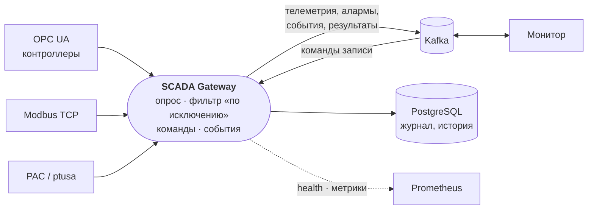
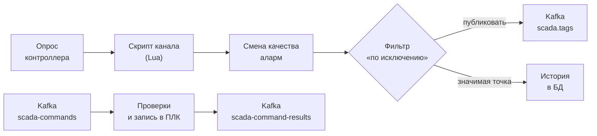

# SCADA Gateway (Rust)

[](https://github.com/EuZireael/SCADA_rust/actions/workflows/ci.yml)
[](https://github.com/EuZireael/SCADA_rust/actions/workflows/audit.yml)

**Шлюз сбора данных АСУ ТП.** Опрашивает промышленные контроллеры по **OPC UA**, **Modbus TCP** и **PAC**
(driver-master, Savushkin/ptusa), публикует телеметрию, события и алармы в **Kafka** для монитора, принимает от него
команды записи и ведёт журнал в **PostgreSQL**. Один процесс на Rust, ≈ 25 % одного ядра и ≈ 125 МБ на 54 800 тегов.



Замена Java-шлюза: **внешние контракты те же** (`controllers.yaml`, топики и формат сообщений Kafka, статусы команд,
переменные окружения, `/actuator/health`, метрики, схема БД), поэтому шлюз встаёт на его место без правок у монитора.

| | Java-шлюз | Rust-шлюз |
|---|---|---|
| Память (стенд, 2517 тегов) | 823 МБ | 14–27 МБ |
| Образ | 646 МБ | ≈ 140 МБ |
| Старт до связи с контроллерами | 17,5 с | < 1 с |
| Остановка по SIGTERM | — | 0,3 с |
| Обнаружение обрыва OPC UA | 30 с | 1 с |

## Содержание

* [Быстрый старт](#быстрый-старт)
* [Возможности](#возможности)
* [Как это работает](#как-это-работает)
* [Настройка](#настройка)
* [Контракт с монитором](#контракт-с-монитором)
* [Эксплуатация](#эксплуатация)
* [Безопасность](#безопасность)
* [Проверено](#проверено)
* [Разработка](#разработка)
* [Структура репозитория](#структура-репозитория)
* [Документация](#документация)

## Быстрый старт

### Стенд одной командой

Нужен Docker с compose. Поднимает PostgreSQL, Kafka, PLC-симулятор и шлюз:

```bash
docker compose up -d --build         # первый раз соберёт образы
curl localhost:8888/actuator/health  # {"status":"UP","components":{"db":…,"kafka":…,"controllers":{…}}}
docker compose logs -f gateway       # журнал шлюза
docker compose down                  # остановить (данные БД сохранятся; -v — стереть)
```

Что получилось: три контроллера симулятора (OPC UA, Modbus, PAC) на связи, 2517 тегов, телеметрия в топике `scada.tags`.
Порты на хост: шлюз `8888`, Kafka `9094`, PostgreSQL `5433` (последние два — только с этого хоста), симулятор
`4840` (OPC UA) / `5020` (Modbus) / `10000` (PAC).

Посмотреть, что уходит в Kafka:

```bash
docker compose exec kafka /opt/kafka/bin/kafka-console-consumer.sh --bootstrap-server localhost:9092 \
  --topic scada.tags --property print.key=true --max-messages 5
# Барановичи-1.BN1_MCA1.M_M.M3.M   {"value":1,"quality":"GOOD","timestamp":1760000000.123456789}
```

### Готовый образ

```bash
docker login ghcr.io -u <пользователь>        # токен с read:packages; пакет приватный
docker run -d --name scada-gateway -p 8888:8888 \
  -v $PWD/controllers.yaml:/app/config/controllers.yaml:ro \
  -e SPRING_KAFKA_BOOTSTRAP_SERVERS=kafka:9092 -e DB_ENABLED=false \
  ghcr.io/euzireael/scada_rust:v0.4.0
```

### Из исходников

Нужны Rust stable, `cmake`, компилятор C/C++ и заголовки libcurl (в Debian/Ubuntu `libcurl4-openssl-dev`, в Arch `curl`):

```bash
docker compose up -d postgres kafka simulator
cargo build --release
SIM_HOST=127.0.0.1 \
SPRING_DATASOURCE_URL=jdbc:postgresql://localhost:5433/scada_db \
SPRING_KAFKA_BOOTSTRAP_SERVERS=localhost:9094 \
./target/release/scada-gateway
```

Подключение к стенду монитора — `docs/MONITOR_INTEGRATION.md`.

## Возможности

* **Три протокола.** OPC UA (политики безопасности, пользователь, проверка сертификатов), Modbus TCP (блочное чтение
  с самонастраивающимся планом), PAC driver-master (собственный протокол прошивки ptusa с Lua-снимком).
* **Телеметрия «по исключению».** Тег уходит в Kafka при первом значении, смене качества, изменении (с зоной
  нечувствительности) и раз в период — «полная отправка»; после сбоя брокера все теги отправляются заново сами.
* **Команды записи** через Kafka: права, приведение типа, срок годности, защита от повтора, проверка, что ПЛК
  действительно изменил значение (`FAILED_NOT_APPLIED`), результат — в `scada-command-results`.
* **Горячее резервирование.** Пара экземпляров на общем Kafka: отказ активного — переключение за ≈ 2 с, новый активный
  сразу шлёт все теги; «слепой» активный сам передаёт роль партнёру.
* **Lua-скрипты** на канал: масштаб, фильтры, проверка обрыва датчика; перезагрузка без перезапуска; песочница с
  лимитами памяти и времени и предохранителем.
* **Устойчивость.** Опрос никогда не ждёт Kafka и БД; упавшие задачи перезапускает надзиратель; сбой одного
  контроллера не трогает остальные; обрыв — кадры `BAD`, а не замершее значение.
* **Безопасность.** TLS/SASL к Kafka, TLS к PostgreSQL, OPC UA с политиками и доверием к сертификатам, токен REST,
  секреты не попадают в журнал, чужой Lua — в песочнице, конфигурацию, которую нельзя применить, шлюз не принимает.
* **Наблюдаемость.** `/actuator/health`, метрики Prometheus, журнал событий в БД и Kafka, REST журнала и алармов.
* **Стенд и проверки.** PLC-симулятор, эмулятор настоящей прошивки, фасад ptusa → OPC UA, нагрузочный стенд, CI с
  интеграционными тестами, сбоями и нагрузкой.

## Как это работает



Подробное устройство — потоки данных, жизненный цикл, надзор за задачами, горячее резервирование, песочницы Lua,
принципы — `docs/ARCHITECTURE.md`.

## Настройка

Две вещи: **переменные окружения** и **`controllers.yaml`** (контроллеры и теги). Самое нужное:

| Переменная | По умолчанию | |
|---|---|---|
| `CONTROLLERS_YAML` | `config/controllers.yaml` | станция; `${ПЕРЕМЕННАЯ:значение}` подставляются из окружения |
| `SPRING_KAFKA_BOOTSTRAP_SERVERS` | `localhost:9092` | брокеры; TLS и SASL — `KAFKA_SECURITY_PROTOCOL`, `KAFKA_SASL_*` |
| `SPRING_DATASOURCE_URL` | `jdbc:postgresql://localhost:5433/scada_db` | БД; `?sslmode=require` — TLS; `DB_ENABLED=false` — без БД |
| `GATEWAY_API_TOKEN` | — | токен `/api/*`; без него REST открыт |
| `GATEWAY_PUBLISH_FULL_RESEND_MS` | `30000` | полная отправка неизменившихся значений |
| `GATEWAY_HA_ENABLED` | `false` | горячее резервирование |
| `GATEWAY_COMMANDS_VERIFY_MS` | `0` | проверка эффекта записи OPC UA |
| `GATEWAY_PERSIST_TELEMETRY` | `false` | история значений в БД |
| `SERVER_PORT` | `8888` | HTTP |

Минимальный `controllers.yaml`:

```yaml
opcua:
  servers:
    - name: "Печь-1"
      endpoint: "opc.tcp://${PLC_HOST:127.0.0.1}:4840"
      enabled: true                       # по умолчанию false
      tags:
        - {name: "Цех.Печь1.Температура", nodeId: "ns=2;s=Temp", dataType: FLOAT, pollingRate: 1000, enabled: true}
        - {name: "Цех.Печь1.Задание",     nodeId: "ns=2;s=SP",   dataType: FLOAT, enabled: true, writable: true}
```

Полный справочник — **`docs/CONFIGURATION.md`**: все переменные, все поля контроллера и тега, подстановки, скрипты и
перечень того, что шлюз проверяет при запуске.

## Контракт с монитором

| Топик | Направление | Ключ | Тело |
|---|---|---|---|
| `scada.tags` | шлюз → монитор | имя тега | `{"value": <число/bool/строка/null>, "quality": "GOOD"/"BAD", "timestamp": <секунды epoch с долями>}` |
| `scada-events` | шлюз → монитор | тип события | событие: тип, источник, важность, сообщение, детали |
| `scada-alarms` | шлюз → монитор | имя тега | аларм: порог, значение, важность, `cleared` |
| `scada-commands` | монитор → шлюз | — | `{"commandId","tagName","value","requestedBy","timestamp"}` |
| `scada-command-results` | шлюз → монитор | имя тега | `{"commandId","status","success","message","appliedValue",…}` |

Статусы команд: `APPLIED`, `REJECTED_UNKNOWN_TAG`, `REJECTED_NOT_WRITABLE`, `REJECTED_TYPE_MISMATCH`, `REJECTED_EXPIRED`,
`FAILED_NO_CONNECTION`, `FAILED_WRITE`, `FAILED_NOT_APPLIED`. Правила публикации «по исключению» —
`docs/TELEMETRY_BY_EXCEPTION.md`, подключение монитора — `docs/MONITOR_INTEGRATION.md`.

## Эксплуатация

* **Здоровье:** `GET /actuator/health` — БД, Kafka, связь с каждым контроллером; в образе есть `HEALTHCHECK`.
* **Метрики:** `GET /actuator/prometheus` (`scada_controllers_connected`, `scada_poll_seconds`, `scada_commands_total`,
  `scada_kafka_resyncs_total`, `scada_ha_active`, …) — полный перечень в `docs/OPERATIONS.md`.
* **REST** (`/api/*`, под токеном): статус, роль в паре, скрипты, журнал событий и алармов, квитирование.
* **Сбои:** что шлюз делает сам (пропал контроллер, Kafka, БД; упала задача; убит процесс) — таблица в
  `docs/OPERATIONS.md`; симптомы и способы чинить — `docs/TROUBLESHOOTING.md`.
* **Остановка:** `SIGTERM` — штатная за доли секунды, партнёр по паре подхватывает сразу.

## Безопасность

Чек-лист перед пуском на объекте — `docs/OPERATIONS.md#чек-лист-безопасности-перед-пуском-на-объекте`: токен REST,
ограничение порта 8888 (`/actuator/*` без токена), `sslmode=require` к БД, SASL/TLS и ACL в Kafka (запись в
`scada-commands` равна праву писать в ПЛК), OPC UA с политикой и доверенными сертификатами, `writable` только где нужно.

## Проверено

Каждый pull request проходит CI (`.github/workflows/ci.yml`), релиз по тегу — только если зелёное всё:

| Проверка | Что доказывает |
|---|---|
| fmt, clippy `-D warnings`, `cargo doc -D warnings` | стиль, отсутствие предупреждений, документация без битых ссылок и пробелов |
| юнит-тесты шлюза | фильтр «по исключению», команды, конфигурация и её проверка, песочница и скрипты, HA-логика, Kafka-безопасность, надзиратель |
| интеграционные (`cargo test -- --ignored`) | протоколы на симуляторе, шлюз целиком глазами монитора, обрыв и возврат связи, горячий резерв (`kill -9`, штатная остановка, «слепой» активный), REST под токеном, защищённый OPC UA, проверка эффекта записи, TLS к БД на настоящем PostgreSQL |
| `stack` — `scripts/stack_smoke.sh` | `docker compose` из исходников и сбои: Kafka пропал на 45 с, БД на 30 с, ПЛК пропал — шлюз жив, после возврата данные восстановлены сами |
| `load` — `scripts/load_check.sh` | 27 400 тегов: опрос не отстаёт, нет потерь и перезапусков, память < 500 МБ |
| симулятор и фасад `ptusa-opcua` | свои fmt/clippy/тесты, сборка образов |
| `cargo audit`, Dependabot | уязвимости и устаревшие зависимости во всех пакетах |

Вручную проверено на настоящей прошивке ptusa (эмулятор мойки, `docker-compose.moika.yml`): 1834 канала `GOOD`, команда
`APPLIED` за 27 мс, переключение резерва; и на нагрузке контракта «по исключению» (54 800 тегов, ≈ 18 000 изменений/с):
≈ 25 % одного ядра, ≈ 125 МБ, потерь нет. **Не проверено** на живом объекте и с настоящим монитором целиком.

## Разработка

```bash
cargo test                      # юнит-тесты и сверка config ↔ simulator, без внешних систем
cargo test -- --ignored         # интеграционные: нужны симулятор, Kafka, Postgres
scripts/stack_smoke.sh          # стенд целиком + сбои (нужен docker compose)
scripts/load_check.sh           # нагрузка на 27 400 тегов
```

Как запустить интеграционные тесты, как устроен CI, соглашения по коду, как добавить настройку, событие, метрику или
протокол, как выпустить релиз — **`docs/DEVELOPMENT.md`**. История версий — `CHANGELOG.md`.

## Структура репозитория

```
src/
  main.rs, startup.rs     запуск и остановка, задачи под надзором (Tasks), HTTP, сигнал
  config/                 настройки: окружение (mod, env), controllers.yaml (station), БД (db), Kafka (client_props)
  model.rs                теги, контроллеры, значения, качество, время, защита OPC UA
  app.rs                  общее состояние, состояние связи, поиск тега для команды
  poller.rs               циклы опроса OPC UA / Modbus / PAC, heartbeat, сводка здоровья
  telemetry.rs            обработка значений: скрипты, смена качества, алармы, фильтры, отправка
  filter.rs               правила публикации «по исключению»
  command.rs              команды записи: статусы, права, типы, проверка эффекта, дубли
  opcua.rs, modbus.rs, pac/   клиенты протоколов
  kafka.rs, messages.rs   продюсер, консьюмер команд, формат сообщений
  events.rs, db.rs        очереди журнала и истории, схема, запросы
  ha.rs, leadership.rs    горячее резервирование
  script/, sandbox.rs     Lua-скрипты каналов и песочница
  supervisor.rs           перезапуск упавших задач
  http.rs, metrics.rs     /actuator/*, /api/*, метрики
migrations/               схема БД (совместима со схемой Java-шлюза)
config/                   controllers.yaml, скрипты, конфигурация станции мойки
tests/                    интеграционные тесты (common/ — запуск шлюза, TCP-прокси)
simulator/                PLC-симулятор: OPC UA + Modbus + PAC, реплей архива станции (отдельный пакет)
ptusa-opcua/              фасад «driver-master → OPC UA» для настоящей прошивки ptusa (отдельный пакет)
loadtest/                 нагрузочный стенд (источник OPC UA-серверов)
scripts/                  стенд, сбои, нагрузка, эмулятор прошивки, PostgreSQL с TLS
tools/                    генератор конфигурации станции
docs/                     документация
docker-compose.yml        стенд целиком;  docker-compose.moika.yml — станция мойки на прошивке
```

### Симулятор и станция мойки

* `simulator/` — PLC-симулятор на Rust: OPC UA, Modbus TCP и PAC (в формате ptusa) в одном процессе, проигрывает
  5-суточный архив станции BN1_MCA1. Повторяет условную логику настоящей прошивки (поля, которые программа ПЛК не
  отдаёт оператору, клапаны только в ручном режиме): `docs/FIRMWARE_WRITE_BEHAVIOR.md`. Подкоманды: `conformance`
  (проверяет, что любой PAC ведёт себя при записи как описано) и `probe-pac host порт` (печатает снимок любого PAC).
* `config/stations/BN1_MCA1.yaml` — 1834 канала станции мойки на одном OPC UA-контроллере; данные даёт эмулятор
  прошивки через фасад `ptusa-opcua/`. Запуск — `MOIKA_PROJECT=<проект ПЛК> ./up-moika.sh`.

## Документация

| Документ | О чём |
|---|---|
| [`docs/ARCHITECTURE.md`](docs/ARCHITECTURE.md) | как шлюз устроен: потоки данных, жизненный цикл, надзор, резервирование, песочницы, принципы |
| [`docs/CONFIGURATION.md`](docs/CONFIGURATION.md) | все переменные окружения, `controllers.yaml`, `scripts.yaml`, проверки при запуске |
| [`docs/OPERATIONS.md`](docs/OPERATIONS.md) | запуск, здоровье, метрики, поведение при сбоях, чек-лист безопасности |
| [`docs/TROUBLESHOOTING.md`](docs/TROUBLESHOOTING.md) | симптом → причина → что делать |
| [`docs/PILOT_CHECKLIST.md`](docs/PILOT_CHECKLIST.md) | пробный запуск на реальном оборудовании: ступени от «только чтение» до монитора, критерии, когда остановиться |
| [`docs/DEVELOPMENT.md`](docs/DEVELOPMENT.md) | сборка, тесты, CI, соглашения, как расширять, релиз |
| [`docs/MONITOR_INTEGRATION.md`](docs/MONITOR_INTEGRATION.md) | подключение монитора, что нового для него |
| [`docs/TELEMETRY_BY_EXCEPTION.md`](docs/TELEMETRY_BY_EXCEPTION.md) | контракт публикации «по исключению», замеры |
| [`docs/FIRMWARE_WRITE_BEHAVIOR.md`](docs/FIRMWARE_WRITE_BEHAVIOR.md) | как настоящая прошивка принимает и игнорирует записи |
| [`docs/FIRMWARE_UNMAPPED_FIELDS.md`](docs/FIRMWARE_UNMAPPED_FIELDS.md) | поля прошивки без канала в базе монитора |
| [`simulator/README.md`](simulator/README.md) | PLC-симулятор: запуск, подкоманды, формат конфигурации, правила прошивки |
| [`ptusa-opcua/README.md`](ptusa-opcua/README.md) | фасад «driver-master → OPC UA» для настоящей прошивки |
| [`loadtest/README.md`](loadtest/README.md) | нагрузочный стенд |
| [`CHANGELOG.md`](CHANGELOG.md) | история версий |

## Отличия от Java-шлюза (намеренные)

* **`pollingRate` учитывается** (Java опрашивала раз в секунду при 2000 мс).
* **БД не на горячем пути**: журнал и история пишутся через очереди отдельными задачами; зависшая база не останавливает
  телеметрию. Выборки REST всегда с `LIMIT`, добавлены индексы.
* **История `telemetry` выключена по умолчанию** (было ≈ 15 ГБ/сутки), при включении — пачками через `UNNEST` и с очисткой
  по сроку.
* **Кадры BAD включены по умолчанию** — монитор к ним готов; при обрыве шлются на каждой попытке переподключения.
* **Смена качества — одно сводное событие на цикл** вместо события на каждый тег.
* **OPC UA без discovery** — подключение прямо к адресу из конфигурации; чтение пачками по 500 узлов.
* **Команды читаются с конца топика**; команда, пролежавшая, пока шлюз стоял, в ПЛК не уходит.
* **Lua от контроллера — в песочнице**: без io/os/package/файлов, без `load`/`loadstring`/`string.dump` и `pcall`, потолок
  64 МБ и 1 с на скрипт — зависший или раздувшийся скрипт рвёт соединение, а не вешает опрос и команды.
* **Modbus подстраивает план чтения под карту регистров**: блок с пропуском в карте делится пополам, пока части не
  прочитаются, в том же цикле и без настройки.
* **Конфигурация проверяется при запуске**: молча не работающий тег или настройка защиты, которую нельзя применить,
  останавливают запуск с понятным текстом.

### Не перенесено

* Режим `recordDevice`/`fields` (в конфигурации не используется).
* JVM-метрики `/actuator/metrics/*`; вместо них метрики Prometheus (`process_*`, `scada_poll_seconds`, …).
* Kerberos (SASL GSSAPI) для Kafka: нужна сборка librdkafka с libsasl2.
* Горячая перезагрузка `controllers.yaml`: изменение станции — перезапуск (в паре — по очереди).
