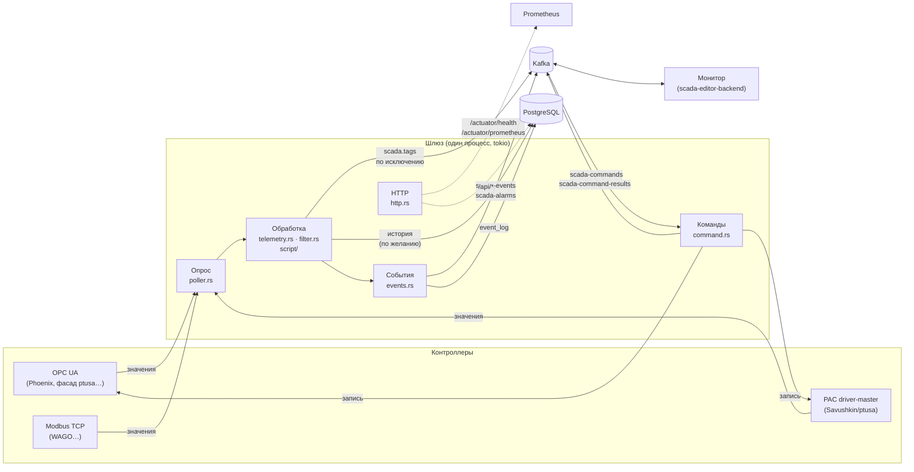
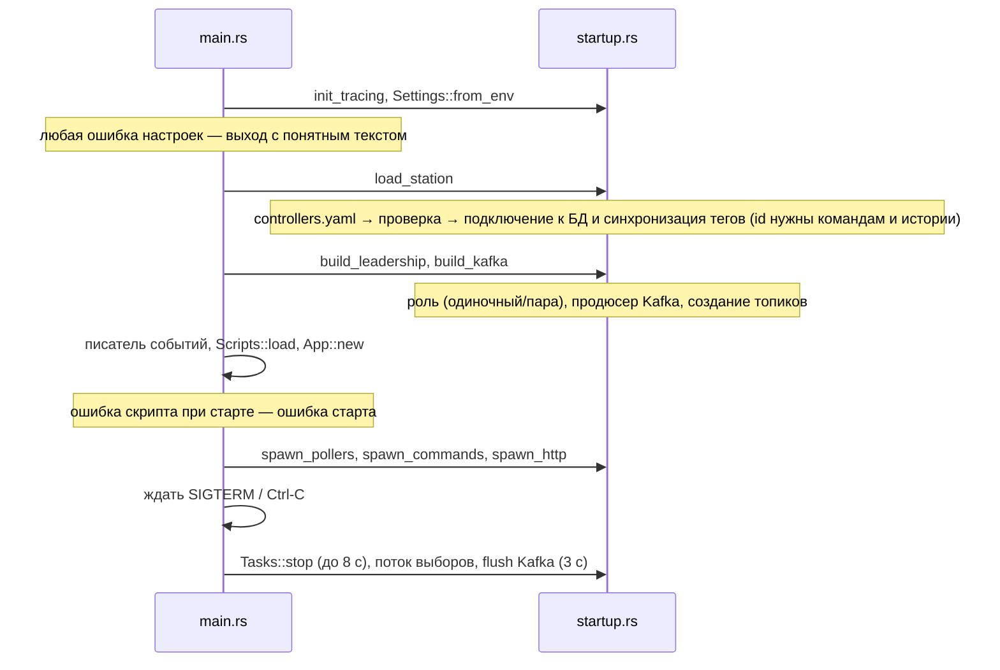
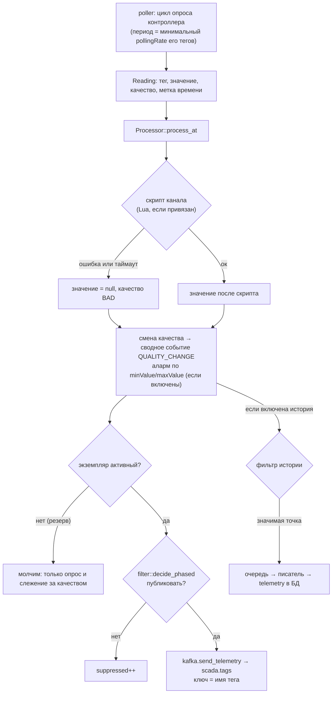
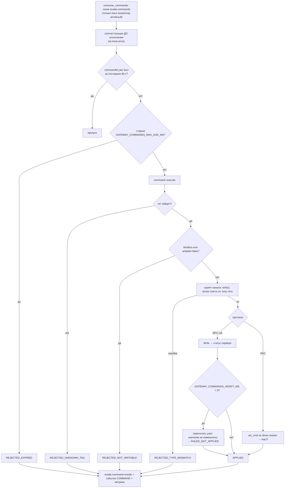
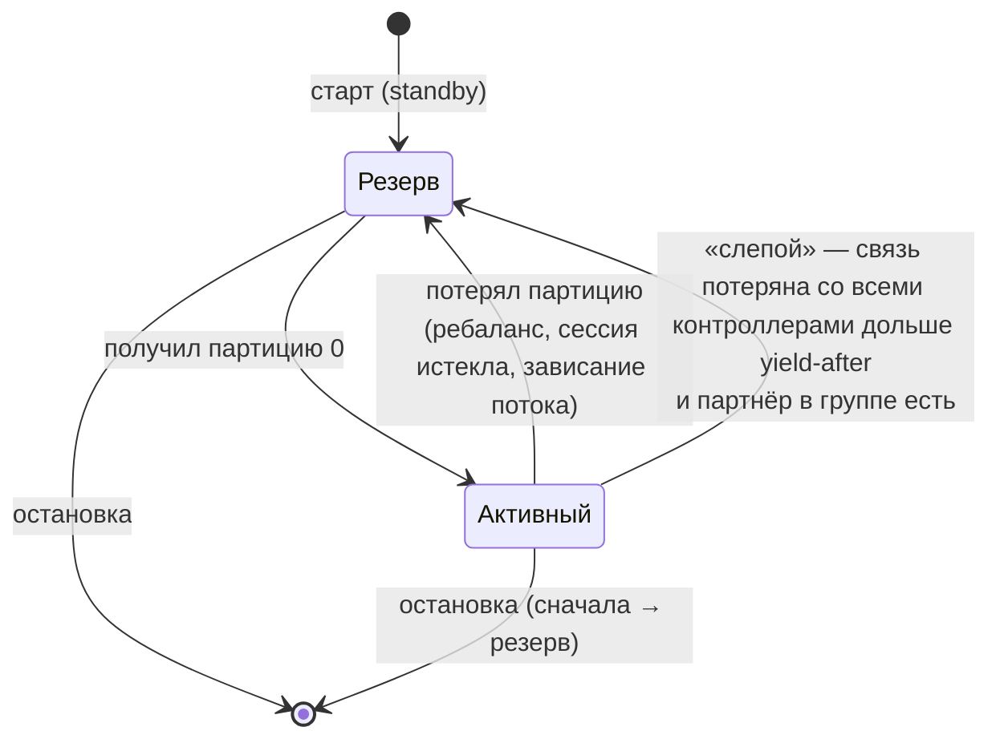

# Архитектура шлюза

Как шлюз устроен изнутри: из чего состоит процесс, как значение проходит путь от контроллера до Kafka, как идёт
команда обратно, что происходит при сбоях и почему сделано именно так. Для тех, кто читает или меняет код;
эксплуатация — `docs/OPERATIONS.md`, настройки — `docs/CONFIGURATION.md`.

* [Общая картина](#общая-картина)
* [Жизненный цикл процесса](#жизненный-цикл-процесса)
* [Задачи и надзор](#задачи-и-надзор)
* [Путь значения: от контроллера до Kafka](#путь-значения-от-контроллера-до-kafka)
* [Путь команды: от Kafka до контроллера](#путь-команды-от-kafka-до-контроллера)
* [Горячее резервирование](#горячее-резервирование)
* [База данных](#база-данных)
* [Протоколы контроллеров](#протоколы-контроллеров)
* [Lua: две песочницы](#lua-две-песочницы)
* [Принципы, на которых всё держится](#принципы-на-которых-всё-держится)
* [Карта модулей](#карта-модулей)

## Общая картина

Шлюз — один процесс. Его работа сводится к четырём потокам данных:

| Поток | Откуда → куда | Где в коде |
|---|---|---|
| **Телеметрия** | контроллер → фильтр «по исключению» → Kafka `scada.tags` (+ история в БД) | `poller.rs` → `telemetry.rs` → `filter.rs` → `kafka.rs` |
| **Команды** | Kafka `scada-commands` → проверки → запись в контроллер → Kafka `scada-command-results` | `kafka.rs` → `command.rs` → `opcua.rs` / `pac/` |
| **События и алармы** | любая часть шлюза → очередь → Kafka `scada-events` / `scada-alarms` и таблица `event_log` | `events.rs`, `kafka.rs`, `db.rs` |
| **Служебное** | выборы активного экземпляра (Kafka), `/actuator/*`, `/api/*`, метрики | `ha.rs`, `leadership.rs`, `http.rs`, `metrics.rs` |

## Жизненный цикл процесса

Порядок запуска зафиксирован в `main.rs::run` и `startup.rs`. Он важен: каждый шаг опирается на предыдущие.

Принципы запуска: **ошибка конфигурации — отказ запуска, а не работа вполсилы.** Неверная защита OPC UA, дубль имён
тегов, неверный `sslmode`, протокол тега не совпадает с контроллером — всё это останавливает шлюз с текстом, что
исправить (`config/station.rs`, `config/db.rs`). Зато недоступность Kafka или БД при запуске — не отказ: шлюз стартует
и подключается, когда они появятся (БД ждёт до минуты, Kafka пробует сама librdkafka).

Остановка: сигнал → `Tasks::stop` отменяет общий `CancellationToken`, ждёт задачи не дольше 8 с → поток выборов
переводит роль в «резерв» и выходит из группы (партнёр подхватывает за доли секунды) → очередь продюсера Kafka
досылается (3 с).

## Задачи и надзор

Все долгоживущие части — задачи tokio, собранные в `startup::Tasks`:

* **Под надзором** (`supervisor.rs`): опрос каждого контроллера, приём команд, перезагрузка скриптов, журнал смены
  роли, health-log, heartbeat. Упавшая (паника) или завершившаяся без остановки задача перезапускается с паузой
  1 → 2 → … → 30 с; после минуты нормальной работы пауза сбрасывается. Каждый перезапуск — строка в журнале,
  метрика `scada_task_restarts_total{task}` и событие `SYSTEM/ERROR`. Без надзора паника в задаче опроса молча
  оставила бы контроллер без опроса при «живом» `/actuator/health`.
* **Фоновые** (без надзора, работают до отмены): писатель событий, писатель истории, HTTP-сервер.

Панику в процессе не превращаем в аварийный выход (`panic = "abort"` не используется): иначе одна ошибка в скрипте
останавливала бы шлюз целиком.

## Путь значения: от контроллера до Kafka

Подробности по шагам:

1. **Опрос** (`poller.rs`). Задача на контроллер, своя для каждого протокола (`run_opcua`, `run_modbus`, `run_pac`).
   Период — наименьший положительный `pollingRate` тегов контроллера, не меньше 100 мс. Тик с политикой `Delay`:
   если цикл не уложился, следующий не «догоняет» пропущенные, а начинается позже; `scada_poll_overruns_total`
   считает такие циклы. OPC UA читается пачками по 500 узлов, Modbus — блоками регистров, PAC — одним снимком
   всех приборов.
2. **Обрыв.** Любой сбой чтения превращается в кадры `BAD` по всем тегам контроллера (`telemetry::all_bad`), связь
   помечается потерянной (`App::mark_down` → событие `CONNECTION`/`DISCONNECTED`), опрос переподключается сам.
   Кадры BAD идут на каждой попытке: монитор, перезапущенный во время обрыва, читает топик с конца и иначе не узнал
   бы, что значения недостоверны.
3. **Обработка** (`telemetry.rs::Processor`). Один `Processor` на контроллер, он хранит по слоту на тег: последнее
   качество, состояние фильтра публикации, состояние фильтра истории и фазу полной отправки. Слот — индекс в
   векторе, а не поиск в хеш-таблице по имени: при десятках тысяч тегов в секунду это заметно.
4. **Фильтр «по исключению»** (`filter.rs`). Правила и порядок их проверки — контракт с монитором
   (`docs/TELEMETRY_BY_EXCEPTION.md`), менять нельзя. Решение запоминается сразу, поэтому `decide_phased`
   вызывают только для значений, которые действительно уйдут дальше.
5. **Отправка** (`kafka.rs`). `send_telemetry` собирает JSON `{"value":…,"quality":"GOOD","timestamp":…}` в
   переиспользуемый буфер потока и ставит его в очередь librdkafka; **сеть не ждёт**. Доставку считает колбэк
   продюсера. Если брокер лежит, сообщения копятся и теряются через 30 с — свежий цикл опроса пришлёт актуальное.
6. **Восстановление доставки.** Недоставленное сообщение фильтр уже считал отправленным: без помощи потребитель не
   узнал бы значение до полной отправки. Поэтому `DeliveryState` считает «эпоху»: когда после сбоя прошло первое
   успешно доставленное сообщение, эпоха растёт, и каждый `Processor` на следующем цикле сбрасывает фильтры и
   отправляет все теги заново (`scada_kafka_resyncs_total`).

## Путь команды: от Kafka до контроллера

Решения, которые стоит знать:

* **At-most-once.** Позиция в топике коммитится *до* исполнения: повторная запись управляющей команды после сбоя
  опаснее потерянной. Потерянная видна монитору как `NO_CONFIRMATION` (результат неизвестен). Дополнительно
  `Dedup` отбрасывает повтор того же `commandId` в течение 60 с.
* **Ручное назначение партиций** без членства в группе: после отказа активного новому не нужно ждать, пока брокер
  выгонит мёртвого члена (десятки секунд). Позиция хранится коммитом в группе `scada-gateway-group`, первый запуск
  группы — с конца топика.
* **Устаревшие команды не исполняются.** Команда, пролежавшая в топике дольше предела (шлюзы стояли оба), монитором
  давно списана по таймауту, а запоздалая запись была бы неожиданной для оператора.
* **Modbus только на чтение**, даже если в конфигурации ошибочно `writable: true`: у holding-регистра нет признака
  «только чтение», и ошибка в конфигурации молча перезаписала бы регистр прибора.
* **`APPLIED` не всегда значит «значение изменилось».** Прошивка может принять команду и проигнорировать её (программа
  не разрешает действие). Для OPC UA это ловит проверка эффекта `GATEWAY_COMMANDS_VERIFY_MS`; у PAC код 0 означает
  «принято», проверить результат нельзя (`docs/FIRMWARE_WRITE_BEHAVIOR.md`).
* **Значение, подставляемое в Lua-текст** команды PAC (`set_cmd`), — только конечное число или bool; имена прибора и
  поля проверяются при запуске. Строка там была бы кодом.

## Горячее резервирование

Два экземпляра с `GATEWAY_HA_ENABLED=true`, общим Kafka и общей БД. Выборы — группа потребителей Kafka на служебном
топике из **одной партиции**: Kafka отдаёт партицию ровно одному члену группы, он и активный.

* **Активный** публикует телеметрию, события и алармы, пишет историю и исполняет команды. **Резерв** держит
  соединения и опрашивает (поэтому, став активным, выдаёт свежие значения уже на первом цикле), но молчит наружу.
* **Почему Kafka, а не отдельный арбитр.** Kafka — единственный канал шлюза к монитору, поэтому выборы через неё не
  добавляют точки отказа. Split-brain безвреден: экземпляр, потерявший брокера и не узнавший о смене лидера, всё
  равно ничего не может опубликовать или принять.
* **Защиты.** `cooperative-sticky` (вернувшийся резерв не отбирает лидерство у живого активного); колбэк ребаланса
  и опрос назначения раз в 100 мс; `max.poll.interval.ms = 30 с` (зависший поток выборов выпадает из группы).
* **При получении лидерства** растёт счётчик `Leadership::activations`; каждый `Processor` видит это и сбрасывает
  фильтры, так что новый активный первым циклом отправляет все теги.

## База данных

PostgreSQL необязателен (`DB_ENABLED=false`). Что в ней:

| Таблица | Назначение |
|---|---|
| `controllers`, `tags` | зеркало `controllers.yaml` (YAML — источник истины): шлюз синхронизирует их при запуске и получает `id` тегов |
| `event_log` | журнал событий: подключения, команды, алармы, heartbeat, смена роли |
| `telemetry` | история значений (выключена по умолчанию: ~15 ГБ/сутки на станцию), с очисткой по сроку хранения |

Правила: **БД не на горячем пути.** События и история идут через ограниченные очереди и отдельные задачи; при
недоступной БД строки теряются со счётчиком (`scada_db_rows_lost_total`), а опрос и Kafka не страдают. Синхронизация
тегов — одной транзакцией под `pg_advisory_xact_lock`: две копии пары стартуют одновременно и не вставляют одни и те
же строки. Ключ тега — `(controller, node_id)`, поэтому два тега с одним адресом получили бы общий `id`; такая
конфигурация отвергается при запуске. Схема — `migrations/`, совместима со схемой Java-шлюза.

## Протоколы контроллеров

| Протокол | Модуль | Особенности |
|---|---|---|
| **OPC UA** | `opcua.rs` | подключение прямо к адресу из конфигурации (без discovery); чтение пачками по 500 узлов; политики безопасности и пользователь; недоверенный сертификат сервера отвергается, пока его нет в `trusted/`; запись и проверка эффекта |
| **Modbus TCP** | `modbus.rs` | только чтение holding-регистров (FC03); блоки до 120 регистров вместе с промежутками; при `IllegalDataAddress` блок делится пополам, пока части не прочитаются |
| **PAC driver-master** | `pac/` | собственный протокол прошивки ptusa: кадры с zlib, ответ — Lua-скрипт с таблицей `t`; значения читаются из настоящего Lua-стейта; запись — `set_cmd` |

## Lua: две песочницы

Lua встречается в шлюзе в двух местах, и в обоих исполняется **чужой код**, поэтому оба идут через `sandbox.rs`:

1. **Ответы PAC** (`pac/lua.rs`). Контроллер (то есть любой, кто ответит на порту PAC) присылает Lua-текст. Стейт
   получает только `base`/`string`/`table`/`math`; убраны `load`, `loadstring`, `string.dump` (байткод Lua 5.1 не
   проверяется — выход из песочницы в память процесса), `dofile`, `require`, `pcall`/`xpcall` и `coroutine`
   (перехватили бы ошибку лимита времени), `collectgarbage`, `setfenv` и родственные. Потолок памяти 64 МБ, время
   1 с на скрипт; zlib-распаковка ограничена 8 МБ.
2. **Пользовательские скрипты каналов** (`script/`). Инженер кладёт `.lua` и `scripts.yaml` в папку; скрипты
   привязываются к тегам по маскам. Потолок памяти 32 МБ, время — `GATEWAY_SCRIPTS_TIMEOUT_MS` (50 мс) на вызов,
   предохранитель отключает скрипт на 30 с после трёх превышений времени подряд. Папка перечитывается без
   перезапуска; версия с ошибкой не применяется, работает прежняя.

Лимит времени — хук по счётчику инструкций (`sandbox::run_limited`); он же проверяет, что вызов, «успешно»
вернувшийся, не превысил бюджет.

## Принципы, на которых всё держится

1. **Опрос никогда не ждёт внешние системы.** Kafka — очередь продюсера без ожидания; БД — очереди и отдельные
   задачи; события — `try_send`. Переполнение очереди — счётчик, а не блокировка.
2. **Сбой одного контроллера не трогает остальные.** У каждого своя задача, свой `Processor`, своё состояние.
3. **Молчаливо неверное хуже громкого отказа.** Конфигурацию, при которой тег или защита не работали бы, шлюз
   не принимает на запуске; настройку защиты, которую нельзя применить, не отбрасывает.
4. **Недостоверное помечается, а не скрывается.** Обрыв — кадры `BAD`, а не замершее последнее значение.
5. **Управляющая команда лучше потерянная, чем выполненная дважды** (at-most-once, дедупликация, срок годности).
6. **Секреты не попадают в журнал** (`Secret`, `ClientProperties`, `OpcSecurity` скрывают значения в `Debug`).
7. **Чужой код — только в песочнице** с лимитами памяти и времени.
8. **Измеряемое и проверяемое.** Нагрузка, сбои и безопасность проверяются в CI (`docs/DEVELOPMENT.md`).

## Карта модулей

| Файл | Ответственность |
|---|---|
| `main.rs` | запуск и остановка, подкоманда `healthcheck` |
| `startup.rs` | шаги запуска, `Tasks` (надзор и остановка), HTTP, сигнал |
| `config/` | `mod.rs` — настройки из окружения; `env.rs` — чтение переменных, `Secret`; `station.rs` — `controllers.yaml` и его проверка; `db.rs` — адрес и TLS БД; `client_props.rs` — свойства безопасности Kafka |
| `model.rs` | теги, контроллеры, значения, качество, метка времени, параметры защиты OPC UA |
| `app.rs` | общее состояние, состояние связи с контроллерами, поиск тега для команды |
| `poller.rs` | циклы опроса трёх протоколов, heartbeat, сводка здоровья |
| `telemetry.rs` | обработка значений: скрипты, смена качества, алармы, фильтры, отправка |
| `filter.rs` | правила публикации «по исключению», разброс полной отправки |
| `command.rs` | выполнение команд, статусы, проверка эффекта, дедупликация |
| `opcua.rs`, `modbus.rs`, `pac/` | клиенты протоколов |
| `kafka.rs` | продюсер, учёт доставки, консьюмер команд, создание топиков |
| `messages.rs` | формат сообщений Kafka (контракт с монитором) |
| `events.rs`, `db.rs` | события и история: очереди, писатели, схема, запросы |
| `ha.rs`, `leadership.rs` | выборы активного экземпляра и роль |
| `script/`, `sandbox.rs` | пользовательские скрипты и песочница Lua |
| `supervisor.rs` | перезапуск упавших задач |
| `http.rs`, `metrics.rs` | `/actuator/*`, `/api/*`, метрики Prometheus |
