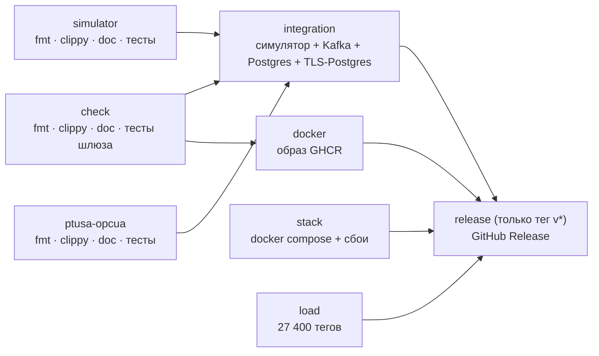

# Разработка

Как собрать, проверить и изменить шлюз. Устройство — `docs/ARCHITECTURE.md`, настройки — `docs/CONFIGURATION.md`.

* [Что нужно](#что-нужно)
* [Состав репозитория](#состав-репозитория)
* [Сборка и запуск](#сборка-и-запуск)
* [Тесты](#тесты)
* [CI/CD](#cicd)
* [Соглашения по коду](#соглашения-по-коду)
* [Как добавить…](#как-добавить)
* [Релиз](#релиз)

## Что нужно

* Rust stable (edition 2024), `cmake` и компилятор C/C++: librdkafka и Lua собираются из исходников и вшиваются
  в бинарник (OpenSSL — тоже).
* Заголовки libcurl: librdkafka 2.12 включает `curl/curl.h` даже без curl (Debian/Ubuntu — `libcurl4-openssl-dev`,
  Arch — `curl`). Линковки с libcurl нет.
* Docker с compose — для стенда и интеграционных тестов.

## Состав репозитория

Четыре независимых пакета Rust (у каждого свой `Cargo.lock`, общего workspace нет) и один инструмент на Java:

| Путь | Что это |
|---|---|
| `/` | сам шлюз: библиотека `scada_gateway` (`src/lib.rs`) и бинарник `scada-gateway` (`src/main.rs`) |
| `simulator/` | PLC-симулятор: OPC UA, Modbus TCP и PAC в одном процессе, проигрывает 5-суточный архив станции; `simulator conformance` и `probe-pac` — служебные подкоманды |
| `ptusa-opcua/` | фасад «driver-master → OPC UA»: выставляет OPC UA-сервером всё, что отдаёт прошивка ptusa |
| `loadtest/loadsim/` | источник нагрузки: десятки OPC UA-серверов с тысячами меняющихся узлов |
| `tools/station-config/` | генератор конфигурации станции (Java, единственный не-Rust кусок) |

Прочее: `config/` — `controllers.yaml`, скрипты, конфигурация мойки; `migrations/` — схема БД; `scripts/` — стенд, сбои,
нагрузка, TLS-PostgreSQL; `docs/` — документация; `tests/` — интеграционные тесты шлюза.

## Сборка и запуск

```bash
cargo build --release                       # target/release/scada-gateway
docker compose up -d postgres kafka simulator
SIM_HOST=127.0.0.1 \
SPRING_DATASOURCE_URL=jdbc:postgresql://localhost:5433/scada_db \
SPRING_KAFKA_BOOTSTRAP_SERVERS=localhost:9094 \
./target/release/scada-gateway
curl localhost:8888/actuator/health
```

Стенд целиком (всё в Docker): `docker compose up -d --build`. Станция мойки на настоящей прошивке — `up-moika.sh`
(`docs/MONITOR_INTEGRATION.md`). Симулятор отдельно: `cd simulator && cargo run --release -- config/replay_config.yaml`.

Профиль release: thin LTO и `strip`. Fat LTO и `codegen-units=1` проверены и не дали выигрыша по процессору при
вдвое большем времени сборки, поэтому не включены.

## Тесты

Четыре уровня, от быстрого к полному:

| Уровень | Команда | Что нужно | Что проверяет |
|---|---|---|---|
| **Юнит** | `cargo test` | ничего | фильтр «по исключению», команды, конфигурация и её проверка, песочница и скрипты, HA-логика, формат сообщений, сверка `controllers.yaml` ↔ конфигурация симулятора |
| **Интеграционные** | `cargo test -- --ignored` | симулятор, Kafka, (Postgres) | клиенты протоколов, шлюз целиком глазами монитора, обрыв связи через TCP-прокси, горячий резерв (`kill -9`), REST под токеном, защищённый OPC UA, проверка эффекта записи, TLS к БД |
| **Стенд** | `scripts/stack_smoke.sh` | docker compose | `docker compose` из исходников и сбои: пропали Kafka, БД, ПЛК |
| **Нагрузка** | `scripts/load_check.sh` | docker (Kafka) | 27 400 тегов: опрос не отстаёт, нет потерь и перезапусков, память < 500 МБ |

### Как запустить интеграционные тесты у себя

```bash
docker compose up -d postgres kafka          # Kafka — на localhost:9094
(cd simulator && cargo build --release &&
 SIM_OPCUA_USER=operator SIM_OPCUA_PASSWORD=operator-pass OPCUA_ENDPOINT=opc.tcp://127.0.0.1:4840 \
 ./target/release/simulator config/replay_config.yaml &)     # из папки simulator
SIM_HOST=127.0.0.1 KAFKA_BOOTSTRAP=localhost:9094 \
IT_DATABASE_URL=jdbc:postgresql://localhost:5433/scada_it \  # пустая БД: createdb scada_it
IT_HA_SESSION_MS=6000 \
cargo test -- --ignored
```

Для теста TLS к БД ещё: `scripts/pg_tls.sh`, затем `IT_DATABASE_TLS_URL=jdbc:postgresql://localhost:5434/scada_tls
IT_DATABASE_TLS_CA=target/pg-tls/ca.crt` (`tests/db_tls.rs`). Симулятору для защищённых тестов нужны `SIM_OPCUA_USER` и
`SIM_OPCUA_PASSWORD`, как выше; без них три теста `tests/secure.rs`/`tests/simulator.rs` упадут.

| Переменная теста | По умолчанию | Смысл |
|---|---|---|
| `SIM_HOST` | `127.0.0.1` | хост симулятора |
| `KAFKA_BOOTSTRAP` | `localhost:9094` | брокер |
| `CONTROLLERS_YAML` | `config/controllers.yaml` | станция |
| `IT_DATABASE_URL` | не задан | если задан — шлюз в тесте работает с БД, проверяются журнал и REST |
| `IT_HA_SESSION_MS` | `2000` | сессия выборов в тестах HA (брокеру CI нужно ≥ 6000) |

### Подводные камни

* **Тесты внутри одного файла идут параллельно.** Два теста не должны менять один прибор симулятора (например,
  `LINE1V0` в одном и `LINE1V2` в другом): иначе тест, который «по прошивке» ждёт определённое значение, увидит чужую
  запись.
* Интеграционные тесты создают топики с префиксом `it-<id>.` и удаляют их в конце; шлюз запускается процессом
  (`tests/common/gateway.rs`), его журнал — `/tmp/scada-gateway-it-*.log`.
* Проверка на настоящей прошивке — ручная: эмулятор ptusa (`scripts/ptusa_emulator.sh`, `docker-compose.moika.yml`,
  `up-moika.sh`); в CI его нет: нужны проект ПЛК и подмодуль с прошивкой, которых в репозитории шлюза нет.

## CI/CD

`.github/workflows/ci.yml` — каждый push и PR:



* Предупреждения clippy и rustdoc — ошибки; недокументированный публичный элемент — предупреждение, то есть тоже ошибка.
* Образ публикуется на push в `main` (`:latest` и `:<sha>`) и на тег `vX.Y.Z` (`:vX.Y.Z`).
* Права задач по умолчанию — только чтение; публикация образа и Release просят больше в своих задачах.

`.github/workflows/audit.yml` — `cargo audit --deny warnings` по базе RustSec для шлюза, симулятора и фасада: на каждый
push/PR и раз в неделю. Исключения (с обоснованием) — `.cargo/audit.toml` в каждом пакете.

`.github/dependabot.yml` — раз в неделю PR на обновления: crates, образы, actions. Патчи и миноры крейтов ≥ 1.0 идут
одним PR, у 0.x минор ломающий — отдельными.

## Соглашения по коду

* **Язык.** Комментарии, сообщения журнала и документация — по-русски; имена в коде — по-английски.
* **Форматирование.** `cargo fmt` (`rustfmt.toml`: ширина 120). `cargo clippy --all-targets -- -D warnings` чист.
* **Документация.** У каждого файла — заголовок `//!` (что в нём и зачем); у каждого публичного элемента — `///`
  (включение `missing_docs` проверяет это в CI). Комментарий объясняет **зачем и почему**, а не пересказывает код:
  инвариант, неочевидное решение, причина, по которой сделано не «в лоб». Комментарии к шагам — нумерованные, как
  в `telemetry.rs::process_at`.
* **Ошибки.** `anyhow::Result` с контекстом (`.context("…")`), текст ошибки — для оператора: что случилось и что
  исправить. Конфигурация, которую нельзя применить, — отказ запуска, а не предупреждение.
* **Паники.** `unwrap`/`expect` — только на инвариантах запуска (регистрация метрик) и в тестах. Паника в задаче под
  надзором не роняет процесс, но это страховка, а не способ обработки ошибок.
* **Горячий путь** (`telemetry.rs`, `filter.rs`, `kafka.rs::send_telemetry`): без лишних выделений и блокировок.
  Любая правка сопровождается замером (`scripts/load_check.sh`, `loadtest/README.md`).
* **Внешние системы** — только через очереди и таймауты; ничего не ждём без лимита времени.
* **Секреты** — в типах `Secret`/`ClientProperties`/`OpcSecurity`, у которых `Debug` скрывает значение. Не логируйте
  сырые настройки.
* **Тесты.** Новое поведение — с тестом. Баг — сначала тест, который его воспроизводит. Интеграционные тесты помечаются
  `#[ignore = "причина"]` и пишутся против симулятора.

## Как добавить…

### …настройку окружения

1. Поле в нужной структуре `config/mod.rs` (с `///`) и чтение в её `from_env` через `env_bool`/`env_parse`/`env_ms`.
2. Строка в `docs/CONFIGURATION.md` и, если важна, в таблицу `README.md`; запись в `CHANGELOG.md`.
3. Неверное значение должно давать ошибку с именем переменной (это делают `env_parse`/`env_ms`).

### …событие журнала

`app.events.emit(Event::new("ТИП", "Источник", "INFO|WARNING|ERROR|CRITICAL", "сообщение").details(json!({…})))`. Событие
попадёт в `event_log`, в Kafka `scada-events` (если экземпляр активный) и в REST. Типы сейчас: `CONNECTION`,
`QUALITY_CHANGE`, `COMMAND`, `ALARM`, `ALARM_CLEARED`, `HEARTBEAT`, `SCRIPT`, `SYSTEM`, `HA`.

### …метрику

Объявить в `metrics.rs::Metrics` (поле + регистрация в `new`), увеличивать там, где происходит событие. Имя —
`scada_…`, у счётчиков суффикс `_total`; добавить в `docs/OPERATIONS.md`.

### …протокол контроллера

1. Клиент в отдельном модуле (по образцу `modbus.rs`): ленивое соединение, таймаут на каждую операцию, сброс соединения
   при ошибке, декодирование в `TagValue`.
2. Вариант в `model::Protocol` и `model::ControllerKind` (разбор схемы адреса `from_endpoint`).
3. Цикл опроса `run_<протокол>` в `poller.rs` и ветка в `poller::run`. Обязательно: `CycleTimer`, кадры BAD при сбое
   (`telemetry::all_bad`), `app.mark_up/mark_down`.
4. Проверки в `config/station.rs::check_tags` (какие поля обязательны, допустимые значения).
5. Запись — ветка в `command::execute`, если протокол пишется; иначе явный отказ `REJECTED_NOT_WRITABLE`.
6. Сервер того же протокола в `simulator/` и тесты в `tests/simulator.rs`.

### …статус команды

Строка статуса в `command.rs` (`Outcome::fail("СТАТУС", …)`), описание в `docs/OPERATIONS.md` и
`docs/MONITOR_INTEGRATION.md`; монитор разбирает статус как строку, но предупредите Давида о новом.

### …миграцию БД

Новый файл `migrations/NNNN_описание.sql` (только вперёд, существующие не править — sqlx проверяет их контрольные суммы).
Схема совместима со схемой Java-шлюза, поэтому удалять и переименовывать колонки нельзя.

## Релиз

1. Версия в `Cargo.toml`, затем `cargo check` — обновится `Cargo.lock`; тег образа в `docs/OPERATIONS.md`.
2. Раздел `## [X.Y.Z] — дата` в `CHANGELOG.md` из `[Unreleased]` (это же текст GitHub Release).
3. Pull request «Релиз vX.Y.Z», зелёный CI, merge.
4. **На `main`** (`git checkout main && git pull`): `git tag vX.Y.Z && git push origin vX.Y.Z`.

CI проверит, что тег совпадает с `Cargo.toml`, прогонит все проверки, опубликует `ghcr.io/euzireael/scada_rust:vX.Y.Z`
и создаст GitHub Release с текстом раздела. Пакет в GHCR приватный; доступ — по правам репозитория, вход для чтения —
токеном с `read:packages` (`docker login ghcr.io`).
